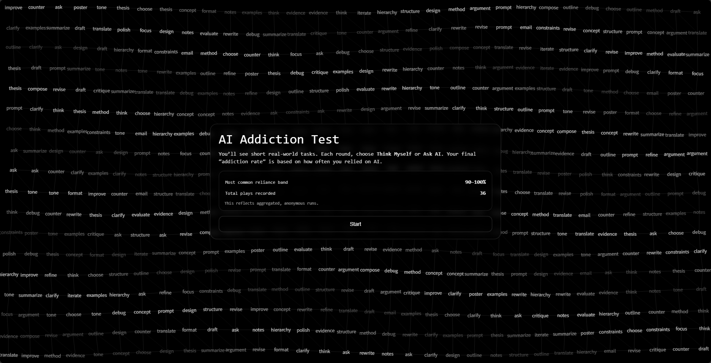
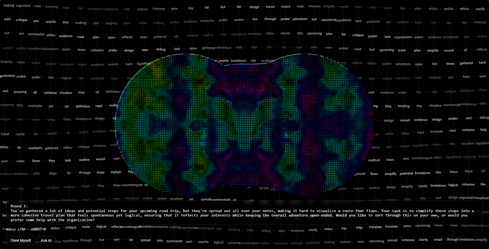
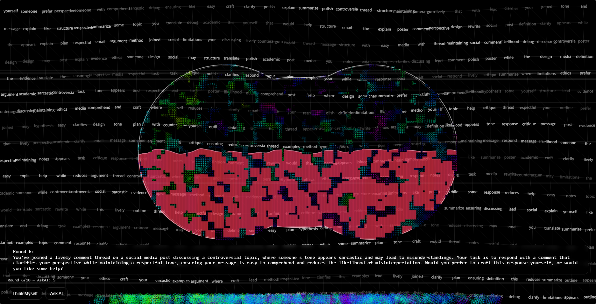
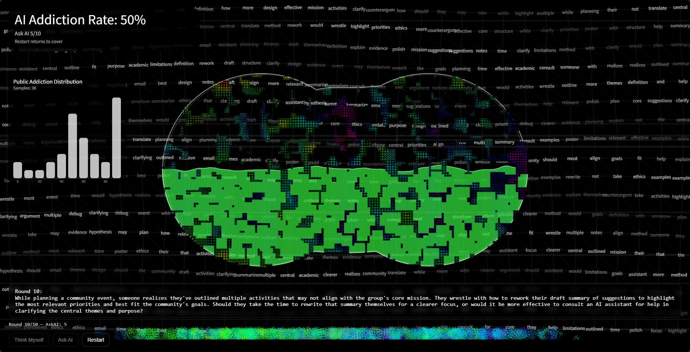

Addiction — AI Reliance Test (Interactive Web Artwork)
**Author:** Aaron Jiang  
**Project:** Addiction  

Addiction is a small interactive web artwork that probes how “efficiency” can slowly turn thinking into something people avoid.  
Instead of treating AI reliance as simple fascination, the project frames dependency as a habit built through repeated cognitive outsourcing: when uncertainty and effort are delegated to computational systems, the user may shift from active thinking to result-checking.  

---

## What you do
You will see 10 short scenario prompts. Each round you choose:

- **Think Myself** (solve without AI)
- **Ask AI** (delegate to AI)

The brain visualization changes when you pick **Ask AI**. At the end, you receive an **AI Addiction Rate** based on how often you relied on AI.

---

## Public summary (anonymous)
This version records only the **final percentage band** (0–9%, 10–19%, …, 90–100) and the total number of runs.  
No personal text, no prompts, no identifiers are stored.

---

## Screenshots / Media (replace these)
> Put your images in a folder like `/public/assets/` or `/docs/`, then replace the paths below.

## Screenshots

**Cover screen**


**Test 01**


**Test 02**


**Result + public distribution**


---

## Tech stack
- Frontend: p5.js + vanilla JS + CSS  
- Backend: Node.js (Express)  
- Optional prompts: OpenAI API via server-side key (not exposed to the client)

---

## Run locally

1) Install
```bash
npm install
```
2) Create
OPENAI_API_KEY=your_key_here
PORT=3000
3) Start
```bash
node app.js
```